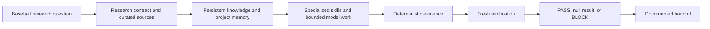
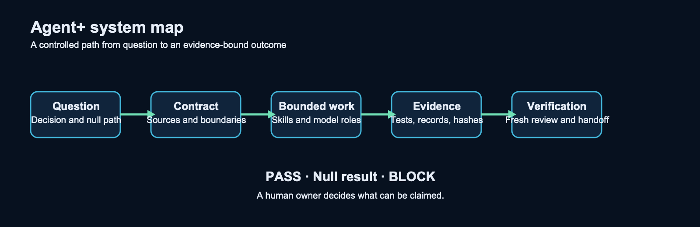

# Agent+

Agent+ is a practical framework for AI-assisted baseball research and analytical products. It puts a controlled system around AI work. The system preserves context, bounds assignments, creates inspectable evidence, and keeps human scientific judgment in charge.

It is designed for analysts who need more than a plausible answer. A reader should be able to trace a question to a contract, a planning gate, an evidence record, a verification result, and a restartable handoff.

> **Public example package.** All examples are synthetic. They demonstrate process only. They do not report results from any private project or claim predictive performance, decision value, or real-world impact.

## What Agent+ is

- A research operating system for baseball questions.
- A set of project instructions, curated knowledge, reusable skills, and bounded model roles.
- A method that separates a maker, deterministic evaluator, fresh verifier, and human decision maker.
- A system where `PASS`, a null result, and `BLOCK` are valid documented outcomes.

## What Agent+ is not

- It is not an autonomous research agent.
- It is not a chatbot, a single prompt, a metric, or a model wrapper.
- It is not proof that a model predicts future baseball events.
- It is not proof that an analysis improves a baseball decision or an operational outcome.

## System workflow

## Five-minute guided tour

1. Start with [the sample question](examples/sample-baseball-research-question.md). It defines the decision, null path, population, time boundary, and permitted claim.
2. Compare it with [the research contract template](templates/research-contract-template.md). A contract freezes what will be tested before results are interpreted.
3. Read [knowledge and memory](docs/knowledge-and-memory.md). It separates durable curated knowledge, current verified state, task handoffs, and instructions.
4. Inspect [routing work by authority](docs/routing-work-by-authority.md). Tools and models receive only the authority needed for a bounded task.
5. Follow [the sample evidence record](examples/sample-evidence-record.md) to [the sample BLOCK](examples/sample-block-outcome.md). The package shows why an incomplete evidence path must stop.
6. Finish with [the sample handoff](examples/sample-handoff.md). A new session can resume from verified facts without relying on a private chat transcript.

## Repository map

| Path | Use |
| --- | --- |
| `AGENTS.md` | Project-wide operating instructions. |
| `CLAUDE.md` | Claude-specific runtime profile. |
| `.claude-memory.md` | Changing, verified project state. |
| `AI_WORKFLOW.md` | Binding authority and model-routing rules. |
| `ESSENTIAL_WORK_PROTOCOL.md` | Necessity card, evidence reuse, and stop rules. |
| `.planning/` | Synthetic project, roadmap, state, plan, evaluation, review, and BLOCK records. |
| `docs/` | Architecture, safety boundaries, and operating rules. |
| `skills/` | Custom Agent+ procedures. |
| `templates/` | Reusable blank records. |
| `examples/` | Sanitized, representative baseball workflow artifacts. |
| `assets/` | Original explanatory diagrams. |

## Quick start

1. Copy the contract, source log, evidence record, and handoff templates into your project.
2. Run `scripts/ai-context.sh` to load the same compact control packet used by the public example.
3. Write a question with a decision and an explicit null or BLOCK path.
4. Complete the [necessity card](.planning/templates/ESSENTIAL-TASK.md), then run the smallest deterministic check that can resolve the task.
5. Request fresh verification before promoting any result to a claim.

## Authority and safety

Agent+ does not treat generated text as evidence. Deterministic code, schemas, source records, hashes, tests, and reviewable artifacts establish evidence. A model can draft, classify, inspect, or implement within its approved boundary. It cannot certify its own work or replace a human scientific decision.

Read [public safety and claim boundaries](docs/public-safety-and-claim-boundaries.md) before using the package for published analysis. Read [integrated tools](docs/integrated-tools.md) to distinguish Agent+ custom procedures from external workflows.

## Public operating-system mirror

The synthetic [planning stack](.planning/STATE.md) mirrors the control flow of a serious baseball research program. It includes an accepted contract, a deterministic coverage evaluation, an independent review, and a valid `BLOCK`. It deliberately stops before modeling. Run `scripts/validate-public-package.sh` before publishing changes.

## License and contributions

This package is released under the MIT License. Contributions must preserve the safety and claim boundaries in [CONTRIBUTING.md](CONTRIBUTING.md).
