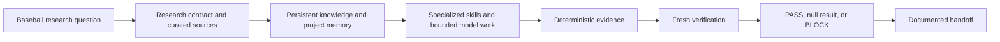

# Agent+

Agent+ is a practical framework for AI-assisted baseball research and analytical products. It puts a controlled system around AI work. The system preserves context, bounds assignments, creates inspectable evidence, and keeps human scientific judgment in charge.

It is designed for analysts who need more than a plausible answer. A reader should be able to trace a question to a contract, a planning gate, an evidence record, a verification result, and a restartable handoff.

> **Public example package.** All examples are synthetic. They demonstrate process only. They do not report results from any private project or claim predictive performance, decision value, or real-world impact.

## Install Agent+

Agent+ is a versioned project control system. The repository is the canonical distribution. A
single prompt or slash command can start the installer, but it is not the system of record.

```sh
git clone https://github.com/traftonobrien/agent-plus.git
cd agent-plus
scripts/agent-plus init \
  --target "/absolute/path/to/baseball-project" \
  --profile research \
  --brain-note "05 Projects/My Baseball Project"
scripts/agent-plus doctor --target "/absolute/path/to/baseball-project"
scripts/agent-plus status --target "/absolute/path/to/baseball-project"
```

The installer creates a version manifest. `status` detects local changes to managed controls.
`upgrade` refuses to overwrite such changes and records one durable recovery transaction if a
filesystem failure interrupts the commit; resume that transaction with `recover --target ...`.
Project data, memory, plans, evidence, and ledgers are project-owned and are never replaced by an
Agent+ upgrade.

## What Agent+ is

- A research operating system for baseball questions.
- A set of project instructions, curated knowledge, reusable skills, and bounded model roles.
- A method that separates a maker, deterministic evaluator, fresh verifier, and human decision maker.
- A system where `PASS`, a null result, and `BLOCK` are valid documented outcomes.

## What Agent+ is not

- It is not an autonomous research agent.
- It is not a chatbot, a single prompt, a metric, or a model wrapper.
- It is not proof that a model predicts future baseball events.
- It is not proof that an analysis improves a baseball decision or an operational outcome.

## System workflow




## Five-minute guided tour

1. Start with [the sample question](examples/sample-baseball-research-question.md). It defines the decision, null path, population, time boundary, and permitted claim.
2. Compare it with [the research contract template](templates/research-contract-template.md). A contract freezes what will be tested before results are interpreted.
3. Read [knowledge and memory](docs/knowledge-and-memory.md). It separates durable curated knowledge, current verified state, task handoffs, and instructions.
4. Inspect [routing work by authority](docs/routing-work-by-authority.md). Tools and models receive only the authority needed for a bounded task.
5. Follow [the sample evidence record](examples/sample-evidence-record.md) to [the sample BLOCK](examples/sample-block-outcome.md). The package shows why an incomplete evidence path must stop.
6. Finish with [the sample handoff](examples/sample-handoff.md). A new session can resume from verified facts without relying on a private chat transcript.

## Repository map

| Path | Use |
| --- | --- |
| `AGENTS.md` | Project-wide operating instructions. |
| `CLAUDE.md` | Claude-specific runtime profile. |
| `.claude-memory.md` | Changing, verified project state. |
| `AI_WORKFLOW.md` | Binding authority and model-routing rules. |
| `ESSENTIAL_WORK_PROTOCOL.md` | Necessity card, evidence reuse, and stop rules. |
| `.planning/` | Synthetic project, roadmap, state, plan, evaluation, review, and BLOCK records. |
| `.agent-plus/engineering-boundaries.json` | Small mutable ledger for engineering BLOCK counts and reset state. |
| `scripts/anti_loop_guard.py` | Fail-closed validator for engineering-sweep and first-error packets. |
| `docs/` | Architecture, safety boundaries, and operating rules. |
| `skills/` | Custom Agent+ procedures. |
| `templates/` | Reusable blank records. |
| `examples/` | Sanitized, representative baseball workflow artifacts. |
| `assets/` | Original explanatory diagrams. |
| `VERSION` | Canonical Agent+ release version. |
| `scripts/agent-plus` | Small install, verify, status, upgrade, recover, and local-project interface. |

The public skill set also includes [`agent-plus-discovery-grill`](skills/agent-plus-discovery-grill/SKILL.md),
which turns a voice or text conversation into a resumable decision brief, and `model-review`, which
audits workflow efficiency and policy drift without treating token use or artifact count as proof
of scientific progress. [`editorial-pass`](skills/editorial-pass/SKILL.md) provides an attributed,
voice-preserving detect and edit workflow with deterministic evidence-token checks. Its
[source record](skills/editorial-pass/references/attribution.md) pins every adapted upstream skill.
[`agent-plus-sync`](skills/agent-plus-sync/SKILL.md) audits an installed project against an exact
official release and uses the transactional lifecycle for an explicitly authorized update.
The external engineering skills used alongside Agent+ are documented in
[integrated tools](docs/integrated-tools.md).

The [implementation subtraction rule](ESSENTIAL_WORK_PROTOCOL.md#implementation-subtraction-ladder)
adapts Dietrich Gebert's Ponytail decision ladder. Its [attribution record](docs/attribution/implementation-subtraction.md)
pins the inspected source and preserves the upstream license.

The optional [`agent-plus` router skill](skills/agent-plus/SKILL.md) helps an agent select the next
bounded procedure. It is a convenience layer. The repository controls and installation manifest
remain authoritative.

## Quick start

1. Install `$agent-plus-discovery-grill` when the project may begin before its decision is contract-ready.
2. Install `$editorial-pass` when the project publishes prose that needs an attributed editorial workflow.
3. Install `$agent-plus-sync` when the project must audit or update its installed Agent+ controls.
4. If the idea is still unclear, create one project-local decision brief and obtain owner confirmation before contract drafting.
5. Copy the contract, source log, evidence record, and handoff templates into your project.
6. Run `scripts/ai-context.sh` to load the same compact control packet used by the public example.
7. Write a question with a decision and an explicit null or BLOCK path.
8. Complete the [necessity card](.planning/templates/ESSENTIAL-TASK.md), then run the smallest deterministic check that can resolve the task.
9. Request fresh verification before promoting any result to a claim.

The anti-loop guard uses a closed structured schema. Every decision field is a fixed enum or an
exact identifier from the guard-owned outcome catalog. A ledger may select a subset of catalog
entries, but it cannot create, rename, or recategorize an outcome. Process evidence such as tests,
lint, files, documents, receipts, and reviews has no catalog entry and cannot be declared as a
user or scientific result. No description, note, or free-text value can change an authorization
result. A packet names a stable boundary and failure class, one `change_kind`, one catalog- and
ledger-approved `outcome_kind` and `outcome_id`, one stop policy, and ledger-bound coverage.
Engineering reviews must finish their attack matrix and named coverage. Two BLOCKs at one boundary
require an architecture reset with the ledger-approved namespace and attempt identifier; scientific
and live packets remain first-error gates.

A reviewed closed-interface recovery remains closed by default. For unattended work, Agent+ uses
one authorized launch, process-written durable evidence, zero AI polling, and one result check after
return. An error consumes that authorization and returns `BLOCK`; retry needs repair and new
explicit authorization.

## Authority and safety

Agent+ does not treat generated text as evidence. Deterministic code, schemas, source records, hashes, tests, and reviewable artifacts establish evidence. A model can draft, classify, inspect, or implement within its approved boundary. It cannot certify its own work or replace a human scientific decision.

Read [public safety and claim boundaries](docs/public-safety-and-claim-boundaries.md) before using the package for published analysis. Read [integrated tools](docs/integrated-tools.md) to distinguish Agent+ custom procedures from external workflows.

## Use Agent+ in another baseball project

Create a project-local control plane with the [baseball-project bootstrap guide](docs/bootstrap-a-baseball-project.md). Choose a `research`, `product`, or `scouting` profile. The initializer will not overwrite existing project controls.

Read [project integration and upstream improvements](docs/project-integration-and-upstream.md) before adapting Agent+ in a proving project. General improvements move to this repository first. Project-specific state never moves upstream.

## Public operating-system mirror

The synthetic [planning stack](.planning/STATE.md) mirrors the control flow of a serious baseball research program. It includes an accepted contract, a deterministic coverage evaluation, an independent review, and a valid `BLOCK`. It deliberately stops before modeling. Run `scripts/validate-public-package.sh` before publishing changes.

## License and contributions

This package is released under the MIT License. Contributions must preserve the safety and claim boundaries in [CONTRIBUTING.md](CONTRIBUTING.md).
