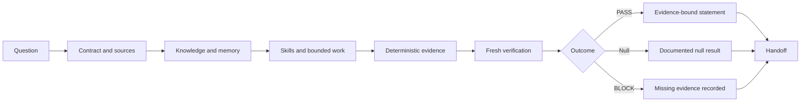

# Architecture

Agent+ turns a baseball research question into documented, reviewable work. It does not automate scientific judgment.

## Components

**Research contract.** States the decision, question, population, temporal boundary, target, comparator, evidence needed, and permitted claim before result review.

**Curated knowledge and memory.** The Obsidian Brain holds durable sources, decisions, and methods. Project memory holds changing verified state. Handoffs preserve one task boundary.

**Specialized skills.** Skills encode small repeatable procedures. They do not grant scientific authority or bypass the contract.

**Bounded model work.** A model receives only the files, authority, budget, and acceptance rule needed for a task.

**Deterministic evidence.** Code, schemas, source logs, hashes, fixtures, and tests establish facts that can be independently checked.

**Fresh verification.** A reviewer examines changed evidence from a clean context. The reviewer may accept, reject, narrow, or block the work.

**Human decision.** A person owns the decision to promote a verified result into a research or operational claim.

## Role separation

| Role | May do | May not do |
| --- | --- | --- |
| Maker | Produce a bounded artifact. | Certify its own result. |
| Evaluator | Run approved deterministic checks. | Interpret beyond the contract. |
| Verifier | Independently inspect changed evidence. | Rewrite the maker artifact silently. |
| Human owner | Accept, narrow, defer, or stop a claim. | Treat generated prose as proof. |

## Canonical distribution seam

The Agent+ repository is the canonical module. Its external interface has four project-lifecycle
operations:

1. `init` creates a project-local control plane.
2. `doctor` verifies required controls and public-safety invariants.
3. `status` compares managed controls and required executable modes with an exact managed-set
   identity in the installation manifest.
4. `upgrade` accepts exact historical manifest generations and permits additive managed-set changes
   only. It rejects unmanaged destination collisions and managed-file removal.
5. `recover --target` is the single idempotent recovery route. It verifies every snapshot hash,
   restores through copy-to-temp plus atomic replace, removes only committed candidate additions,
   and retains recovery assets across partial restore failures.

Project instructions, memory, planning state, evidence, data, and mutable ledgers stay behind the
consumer project seam. They are not Agent+ managed files. Project-specific rules live in
`.agent-plus/PROJECT.md`. This separation lets Agent+ evolve without replacing scientific state.

Skills provide bounded procedures after installation. They do not replace the repository,
installation manifest, project controls, or verification commands.
