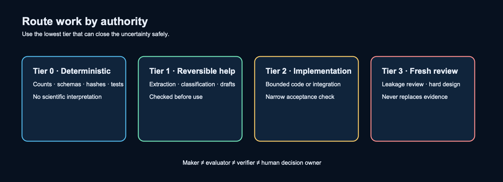

# Routing Work by Authority

Route work by the authority it needs, not by which model is available. Use the lowest-cost method that can safely close the uncertainty.

| Tier | Typical work | Evidence rule | Prohibited authority |
| --- | --- | --- | --- |
| 0: deterministic | Search, parse, count, hash, test, score. | Tool output is recorded. | Narrative scientific judgment. |
| 1: reversible assistance | Extraction, classification, summaries, draft logs. | A human or test checks the result. | Certification, promotion, or unchecked mutation. |
| 2: bounded implementation | Approved code and integration work. | Narrow acceptance checks are required. | Self-certification. |
| 3: independent review | Leakage, hard design, adversarial review. | Fresh review of changed evidence is required. | Replacing deterministic evidence or human ownership. |

Each work order names its files, inputs, owner, model or tool, time budget, attempt limit, stop condition, and acceptance check. Silent model fallback is not allowed.

## Session modes

Choose a mode before dispatch. Higher capacity increases bounded throughput, not authority, context,
retries, or reviewer count.

| Mode | Bounded route | Limit |
| --- | --- | --- |
| `quick` | Sol/high control; ≤1 Luna High explorer; Luna High maker; deterministic evaluator; fresh Luna xhigh only at promotion. | 45 minutes |
| `standard` (default) | Sol/high control; 2 independent Luna High explorers; Luna xhigh maker; deterministic evaluator; 1 fresh Luna xhigh reviewer. | 90 minutes |
| `deep` | Sol/high control; ≤3 independent Luna xhigh explorers; 1 accountable maker (Luna xhigh or explicitly selected Claude Sonnet high; Opus high only for named hard architecture/frozen contract); deterministic evaluator; 1 fresh independent reviewer. | 120 minutes |
| `scientific/live` | ≤2 read-only Luna xhigh readiness explorers; zero parallel workers during live execution; deterministic metrics; fresh premium scientific reviewer only for a named decision; human authorization before data access, live work, or promotion. | Owner-set task budget |

An owner command may authorize this engineering chain: plan → independent explorers → frozen
evidence handoff → exclusive maker → deterministic evaluator → fresh reviewer → Sol synthesis.
Exploration is the only parallel stage. Use a controller plus two workers by default, hard maximum
three workers, one writer per repository, no overlapping writes, no recursive spawn, no silent
fallback, and one bounded wait per stage. The reviewer receives the contract, artifact, receipts, and
attack matrix, not the maker transcript. A maker, evaluator, or reviewer `BLOCK` stops the chain;
reviewer `BLOCK` does not trigger auto-repair.

## Unattended execution

Use one authorized launch when a bounded process can complete without AI supervision. Name the
command, durable progress and terminal evidence, expected return point, and one result check before
launch. The process writes the evidence. The AI controller performs zero polls while it runs and
one check after return.

An error or missing terminal record consumes the authorization and returns `BLOCK`. Do not retry or
use a fallback without bounded repair, required review, and new explicit authorization.

## Budgets and maintenance

Ordinary context remains capped at 25K tokens and premium context at 40K. Target 4–8K for routine
work, 8–15K for implementation, and 12–25K for premium work; start a fresh session at 60–80K
accumulated tokens. Routine makers use at most 32 tool calls/60 minutes, complex makers 40/90
minutes, engineering reviewers 20/45 minutes, and scientific/live reviewers 12/25 minutes. Failed
attempts remain capped at two.

Reserve 25% of premium allowance for scientific, leakage, hard-architecture, or irreversible
decisions. Do not burn capacity without a decision-relevant deliverable. Overnight mode requires an
explicit owner command, allows only read-only or reversible engineering, uses at most three workers
and a fixed queue of eight, checkpoints every 30 minutes or 100K fresh tokens, forbids
live/scientific/promotion work and queue refill, and stops on `BLOCK`.

Repeat model review after 10 completed bounded chains or 14 days, and immediately after a model,
rate, or plan change; two routing `BLOCK`s; average context above 40K; or reviewer correction above
20%. These are routing controls, not evidence of performance.

The Guard v2 closed schema, maker/evaluator/verifier separation, two-BLOCK architecture reset,
first-error scientific/live behavior, deterministic outcome metrics, and human owner decision remain
unchanged.

A reviewed closed-interface recovery remains the default for its failure class. Removed caller
choices stay removed until a new necessity card proves a named consumer and acceptance boundary.
