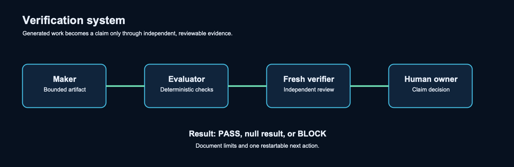

# Verification System

Verification asks whether the claimed evidence exists and supports the stated conclusion. It is not a second draft pass.

## Sequence

1. The maker creates one bounded artifact.
2. The evaluator runs deterministic checks against the contract.
3. A fresh verifier receives the changed artifact and evidence, not the maker's private transcript.
4. The verifier returns `PASS`, `NULL`, or `BLOCK`, with exact reasons.
5. A human owner decides what statement, if any, can be promoted.

## Required record

The evidence record identifies the contract version, inputs, checks, artifact identifiers, outcome, limits, and verifier result. A `BLOCK` names the missing evidence, its downstream effect, and the exact condition for resuming.

## Freshness

Verification is fresh when it examines changed evidence in an independent context. Repeating an unchanged check does not create new evidence.
